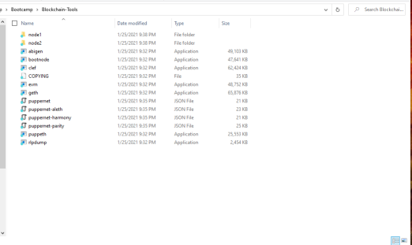
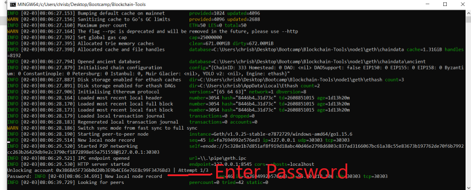
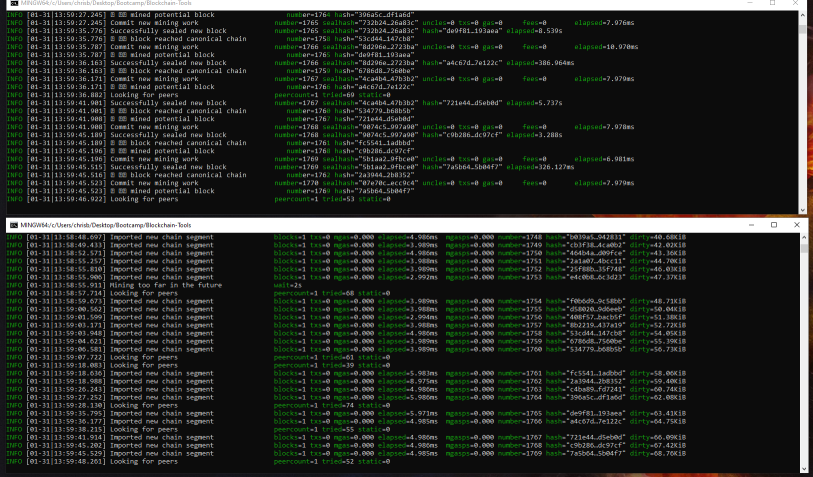
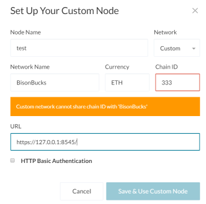
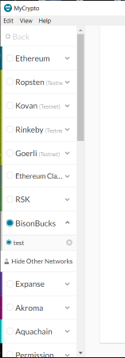
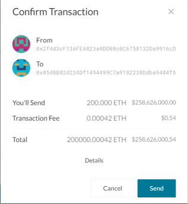
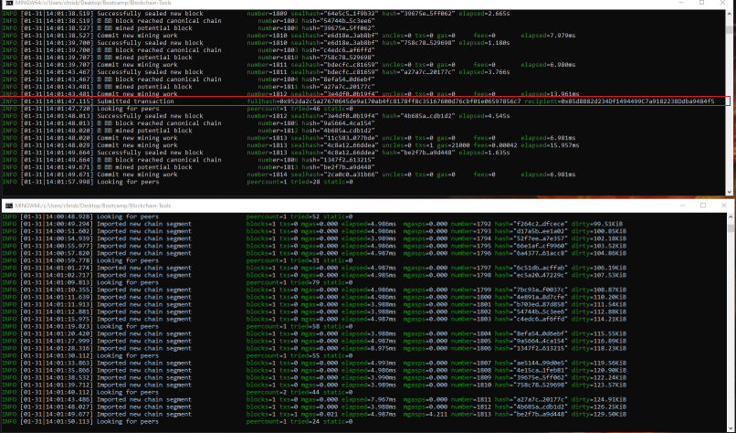
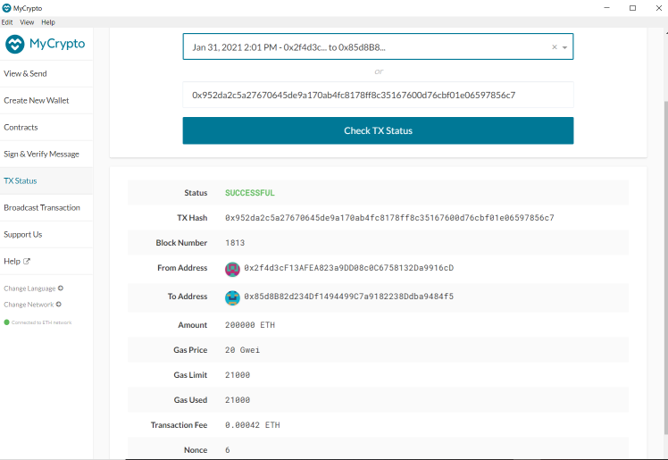

# Bison Bucks!

<strong>This repository contains 2 blockchain nodes that can be started via the following commands:</strong>

### To start Node 1 navigate to to the Blockchain Tools Folder and open a bash terminal. 

### In the terminal enter the following command:
* ./geth --datadir node1 --unlock "0x386BA5F736b0d20b3E9b4CE6e76E8c99F3476Bd3" --mine --miner.threads 2 --rpc --allow-insecure-unlock
* Enter your password 

### To start Node 2 open a seperate bash terminal and enter:
* ./geth --datadir node2 --unlock "0x85d8B82d234Df1494499C7a9182238Ddba9484f5" --port 30305 --bootnodes "enode://5c328e1b7d851af8f919d18abc40d46e2798d6803c837ad3166067bc61a38c55e83673b197762de70f6b7992cc263b26429db9e2c3790cf1872898e65a751558@127.0.0.1:30303" --allow-insecure-unlock --ipcdisable
* Enter your password

### Here is a screenshot of both Nodes working

### Instructions to connect MyCrypto to the Nodes above. 
1) Click Change Network

2) Scroll down to Add Custom Node

3) Setup Node according to screenshot (my network is already setup, that is why we are seeing an error message)

4) Select the custom network

### Instructions to send a transaction with MyCrypto
1) Select View/Send from the main menu and select the private key option

2) Enter the private key
    * 0x34b0ebeb1059e5d777f494e68f703ae0d14f0c0847c396601682c0022a2b4069

3) Select a Wallet address to send ETH to

4) We can see the transaction is recieved by the network

5) We can confirm our transaction was successful by selecting TX status from the MyCrypto main menu

 
